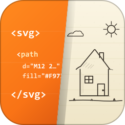

<div align="center">



# SVG Peek

**Preview, format, and fold inline SVG in any file — without leaving the editor.**

[](https://marketplace.visualstudio.com/items?itemName=SvgPeek.svg-peek)
[](https://marketplace.visualstudio.com/items?itemName=SvgPeek.svg-peek)
[](https://marketplace.visualstudio.com/items?itemName=SvgPeek.svg-peek&ssr=false#review-details)
[](https://github.com/Papunidze/svg-peek/actions/workflows/ci.yml)
[](https://github.com/Papunidze/svg-peek/releases/latest)
[](LICENSE)

[Install](#installation) · [Features](#features) · [Commands](#commands) · [Settings](#settings) · [Contributing](CONTRIBUTING.md) · [Changelog](CHANGELOG.md)

</div>

---

Inline `<svg>` blocks in HTML, JSX, TSX, Vue, Markdown, and template literals inside `.ts` / `.js` become first-class citizens: hover to see the rendered image, collapse them so they stop cluttering your code, and pretty-print them with one command.

## Table of contents

- [Features](#features)
- [Commands](#commands)
- [Settings](#settings)
- [Installation](#installation)
- [Usage tips](#usage-tips)
- [Performance](#performance)
- [Known limitations](#known-limitations)
- [Contributing](#contributing)
- [Security](#security)
- [License](#license)

## Features

### Hover preview

Hover anywhere inside an `<svg>…</svg>` block and see it rendered, along with its dimensions and file size. Works in:

- `.svg`, `.xml`, `.html`
- `.js`, `.ts`, `.jsx`, `.tsx`, `.vue`
- `.md` (including fenced code blocks)

Template literal interpolations (`${foo}`) are stripped for the preview, so your runtime-templated SVGs still render as thumbnails.

### Open in Tab

Each hover popup includes an **Open in Tab** link. Click it to open the selected SVG in a side panel with a transparency checkerboard background — great for inspecting transparent regions and seeing the full render.

The preview **updates live** as you edit the source file, so you can see your tweaks applied instantly without reopening the tab. Zoom:

- **Scroll wheel** over the image — zoom in/out, pivoting on the cursor position.
- **Click** on the image — zoom in one step at the clicked point.
- **Shift + click** — zoom out one step at the clicked point.
- Toolbar buttons top-right, or `Ctrl/Cmd + 0` to reset to 100%.

Zoom level is preserved across live updates, so refining an SVG while zoomed in doesn't reset your view.

### Fold and unfold

Long `<svg>` blocks (hundreds of `<path d="…">` lines) make files hard to read. SVG Peek registers a folding region for every `<svg>` so you can collapse them individually via the gutter arrow, or bulk-collapse via the command palette.

### Gutter thumbnails (opt-in)

Enable `svgPeek.gutter.enabled` (or run **SVG Peek: Enable Gutter Thumbnails**) and a small rendered thumbnail of each SVG appears in the gutter next to its opening tag. Always visible, like the built-in color swatches in `settings.json`.

### Format

A deterministic SVG pretty-printer: one element per line, attributes wrap when the tag is dense. Registered as a document formatter for `.svg` and `.xml` (works with `editor.formatOnSave`). For embedded SVGs inside `.ts` / `.js` / `.jsx` / `.tsx`, run **SVG Peek: Format SVG Blocks in File** — it reformats only the `<svg>` regions and leaves surrounding code untouched.

## Commands

All commands are available from the Command Palette (`Ctrl+Shift+P` / `Cmd+Shift+P`):

| Command                                | What it does                                              |
| -------------------------------------- | --------------------------------------------------------- |
| `SVG Peek: Fold All SVGs in File`      | Collapse every `<svg>` block in the active editor         |
| `SVG Peek: Unfold All SVGs in File`    | Expand every `<svg>` block                                |
| `SVG Peek: Format SVG Blocks in File`  | Pretty-print every `<svg>` block in the active editor     |
| `SVG Peek: Enable Gutter Thumbnails`   | Turn on inline gutter previews                            |
| `SVG Peek: Disable Gutter Thumbnails`  | Turn them off                                             |

No default keyboard shortcuts. Assign your own via **Preferences: Open Keyboard Shortcuts** and search `svgPeek`.

## Settings

Only one setting is exposed:

```jsonc
{
  // Show a small rendered thumbnail in the gutter next to every <svg>.
  "svgPeek.gutter.enabled": false
}
```

Toggle from the command palette, or edit `settings.json` directly. Changes apply live.

## Installation

### From the Marketplace

1. Open the **Extensions** view (`Ctrl+Shift+X`).
2. Search for **SVG Peek**.
3. Click **Install**.

Or install from the command line:

```bash
code --install-extension SvgPeek.svg-peek
```

### From a `.vsix` file

Download the latest `.vsix` from the [Releases page](https://github.com/Papunidze/svg-peek/releases/latest) and install it:

```bash
code --install-extension svg-peek-<version>.vsix
```

### From source

```bash
git clone https://github.com/Papunidze/svg-peek.git
cd svg-peek
npm ci
npm run package
npx @vscode/vsce package
code --install-extension svg-peek-*.vsix
```

## Usage tips

- **Read a giant SVG-heavy file**: run `SVG Peek: Fold All SVGs in File` and the file collapses to one line per SVG. Hover any line to see the rendered image.
- **Convert a messy one-line SVG into something readable**: run `SVG Peek: Format SVG Blocks in File`, or just save the file if it's `.svg` / `.xml` and you have format-on-save enabled.
- **Find transparency or a specific color**: click **Open in Tab** from any hover to see the SVG on a checkerboard.

## Performance

- SVG blocks are parsed once per document version and cached, so hover, fold, and decoration lookups share the same work.
- Gutter updates are debounced (180 ms), so rapid typing doesn't thrash.
- All previews are inline data URIs — no temporary files, no extra processes.

## Known limitations

- SVGs containing `<script>` or external resources render inertly (CSP blocks scripts in the preview panel) — intentional, for safety.
- Dynamic SVGs with JS-computed children (e.g. React expressions that build attribute values at runtime) render only the template as written, not the runtime result.
- Auto-fold on open is intentionally not supported — bind the fold command to a shortcut or run it on demand.

## Contributing

Issues and pull requests welcome. See [CONTRIBUTING.md](CONTRIBUTING.md) for dev setup, commit conventions, and the release process.

## Security

If you believe you've found a security issue, please follow the process in [SECURITY.md](SECURITY.md) rather than opening a public issue.

## License

Released under the [MIT License](LICENSE).

<div align="center">

Made with care by <a href="https://github.com/Papunidze">@Papunidze</a>. If SVG Peek saved you a scroll, a ⭐ on the repo is the nicest way to say thanks.

</div>
